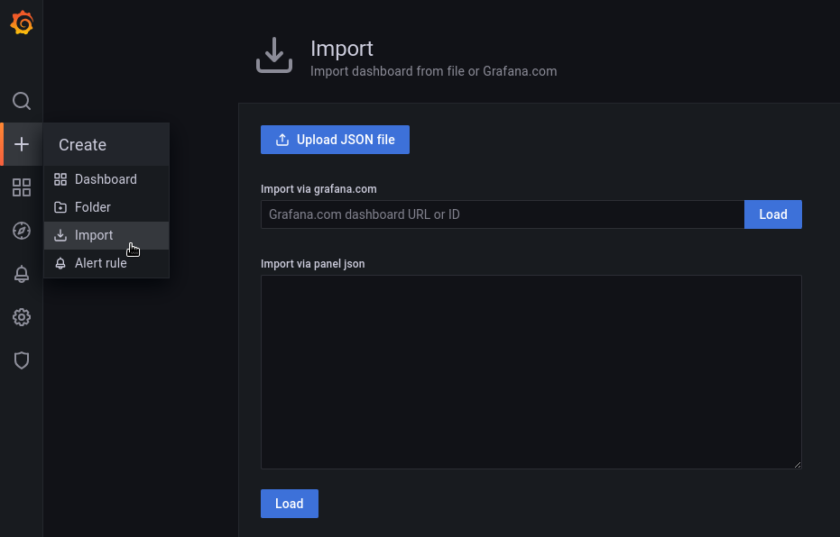
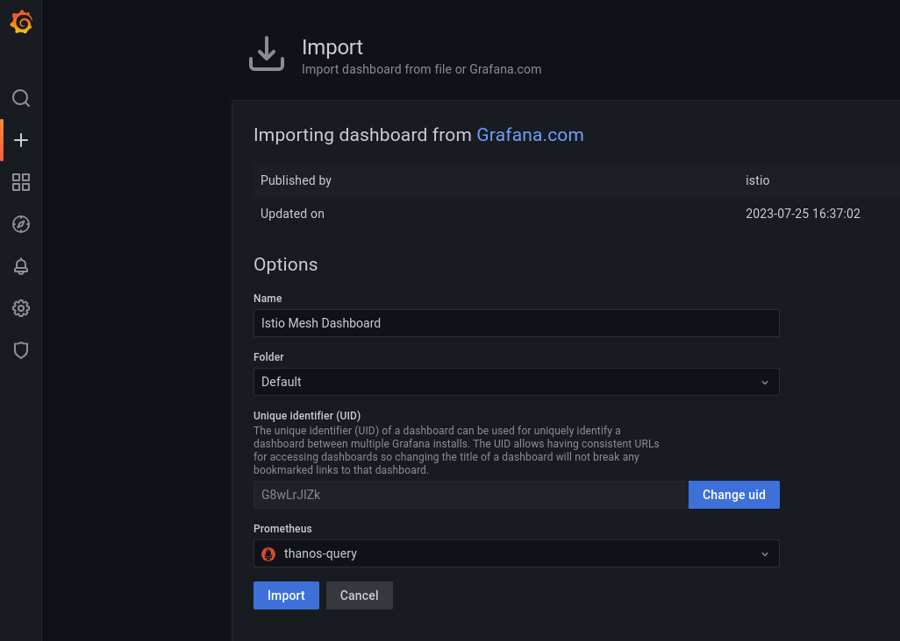
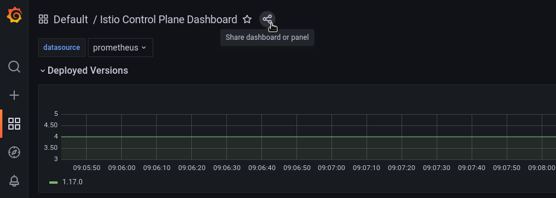
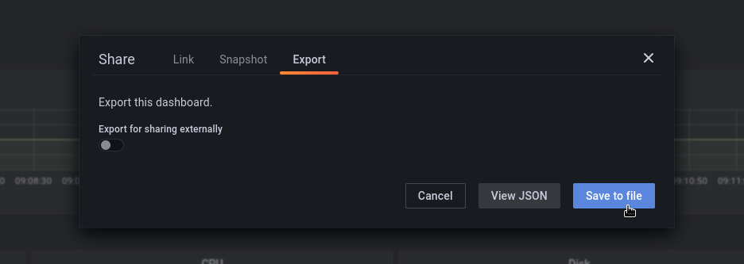

# Developing Grafana Dashboards

## Importing a Dashboard

Dashboards can be imported in the Grafana UI using either raw JSON, a JSON file, or the URL/ID of one of the [dashboards on grafana.com](https://grafana.com/grafana/dashboards/).



To import a dashboard, click on the plus icon on the left sidebar and navigate to **Import**. After entering a dashboard URL/ID or JSON, click **Load**.



After loading the dashboard, the next screen allows you to select a name and folder for the dashboard and specify the data source before finally importing the dashboard.

## Exporting a Dashboard and Adding it to Version Control

Grafana dashboards can be exported as JSON in order to add them to the project's git repo.



When viewing the dashboard you wish to export, click on the **share** button at the top of the screen.



In the modal popup click **Export** and then **Save to file**. Save the JSON file to the MGC repo's `./config/prometheus-for-federation/` directory. In the same directory's `kustomization.yaml` file, add an entry to the `configMapGenerator` pointing to this file. Change the `name` and `files` fields below.

```yaml
apiVersion: kustomize.config.k8s.io/v1beta1
kind: Kustomization

...

configMapGenerator:
...
- name: my-dashboard
  namespace: monitoring
  files:
  - my-dashboard.json
```

For Grafana to make use of this configmap, its `Deployment` needs to be patched to include a `Volume` and `VolumeMount`. Append these to `grafana_deployment_patch.yaml` (change `my-dashboard` to your dashboard's name).

```yaml
- op: add
  path: /spec/template/spec/volumes/-
  value:
    name: my-dashboard
    configMap:
     defaultMode: 420
     name: my-dashboard
- op: add
  path: /spec/template/spec/containers/0/volumeMounts/-
  value:
    name: my-dashboard
    mountPath: /grafana-dashboard-definitions/0/my-dashboard
```

## Updating and Reloading Grafana

To update the dashboard in the Grafana UI, first `apply` the configMap and the patched Grafana deployment to the cluster. `kfilt` is used here to filter all other resources out.

```bash
./bin/kustomize build config/prometheus-for-federation/ | docker run --rm -i ryane/kfilt -i kind=ConfigMap,name=<YOUR_DASHBOARD_CONFIG_MAP_NAME> -i kind=Deployment,name=grafana | kubectl apply -f -
```

Kill the Grafana pod to force a reload of the dashboard configMap from the mounted volume.

```bash
kubectl -n monitoring delete $(kubectl -n monitoring get po -l app.kubernetes.io/component=grafana -o name)
```