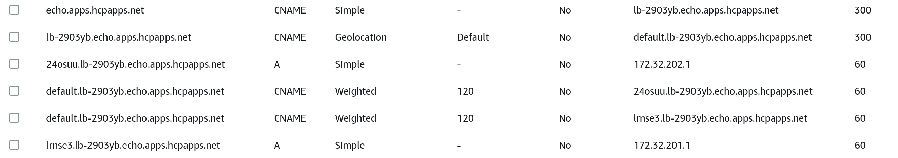
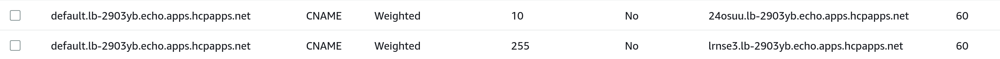
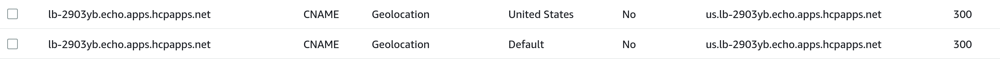
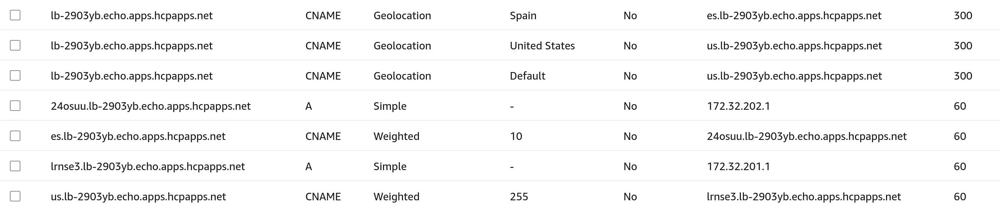

# DNS Policy

The DNSPolicy is a [GatewayAPI](https://gateway-api.sigs.k8s.io/) policy that uses `Direct Policy Attachment` as defined in the [policy attachment mechanism](https://gateway-api.sigs.k8s.io/v1alpha2/references/policy-attachment/) standard.
This policy is used to provide dns management for gateway listeners by managing the lifecycle of dns records in external dns providers such as AWS Route53 and Google DNS.

## Terms

- [`GatewayAPI`](https://gateway-api.sigs.k8s.io/): resources that model service networking in Kubernetes.
- [`Gateway`](https://gateway-api.sigs.k8s.io/api-types/gateway/): Kubernetes Gateway resource. 
- [`ManagedZone`](https://github.com/Kuadrant/multicluster-gateway-controller/blob/main/config/crd/bases/kuadrant.io_managedzones.yaml): Kuadrant resource representing a [Zone Apex](https://www.rfc-editor.org/rfc/rfc7719) in a dns provider.
- [`DNSPolicy`](https://github.com/Kuadrant/multicluster-gateway-controller/blob/main/config/crd/bases/kuadrant.io_dnspolicies.yaml): Kuadrant policy for managing gateway dns.
- [`DNSRecord`](https://github.com/Kuadrant/multicluster-gateway-controller/blob/main/config/crd/bases/kuadrant.io_dnsrecords.yaml): Kuadrant resource representing a set of records in a managed zone.

## DNS Provider Setup

A DNSPolicy acts against a target Gateway by processing its listeners for hostnames that it can create dns records for. In order for it to do this, it must know about dns providers, and what domains these dns providers are currently hosting.
This is done through the creation of ManagedZones and dns provider secrets containing the credentials for the dns provider account.

If for example a Gateway is created with a listener with a hostname of `echo.apps.hcpapps.net`:
```yaml
apiVersion: gateway.networking.k8s.io/v1beta1
kind: Gateway
metadata:
  name: prod-web
  namespace: multi-cluster-gateways
spec:
  gatewayClassName: kuadrant-multi-cluster-gateway-instance-per-cluster
  listeners:
    - allowedRoutes:
        namespaces:
          from: All
      name: api
      hostname: echo.apps.hcpapps.net
      port: 80
      protocol: HTTP
```

In order for the DNSPolicy to act upon that listener, a ManagedZone must exist for that hostnames domain. 

A secret containing the provider credentials must first be created:
```bash
kubectl create secret generic my-aws-credentials --type=kuadrant.io/aws --from-env-file=./aws-credentials.env -n multi-cluster-gateways
kubectl get secrets my-aws-credentials -n multi-cluster-gateways -o yaml
apiVersion: v1
data:
  AWS_ACCESS_KEY_ID: <AWS_ACCESS_KEY_ID>
  AWS_REGION: <AWS_REGION>
  AWS_SECRET_ACCESS_KEY: <AWS_SECRET_ACCESS_KEY>
kind: Secret
metadata:
  name: my-aws-credentials
  namespace: multi-cluster-gateways
type: kuadrant.io/aws
```

And then a ManagedZone can be added for the desired domain referencing the provider credentials:
```yaml
apiVersion: kuadrant.io/v1alpha1
kind: ManagedZone
metadata:
  name: apps.hcpapps.net
  namespace: multi-cluster-gateways
spec:
  domainName: apps.hcpapps.net
  description: "apps.hcpapps.net managed domain"
  dnsProviderSecretRef:
    name: my-aws-credentials
    namespace: multi-cluster-gateways
    type: AWS
```

## DNSPolicy creation and attachment

Once an appropriate ManagedZone is configured for a Gateways listener hostname, we can now create and attach a DNSPolicy to start managing dns for it.

```yaml
apiVersion: kuadrant.io/v1alpha1
kind: DNSPolicy
metadata:
  name: prod-web
  namespace: multi-cluster-gateways
spec:
  targetRef:
    name: prod-web
    group: gateway.networking.k8s.io
    kind: Gateway
  healthCheck:
    allowInsecureCertificates: true
    additionalHeadersRef:
      name: probe-headers
    endpoint: /
    expectedResponses:
      - 200
      - 201
      - 301
    failureThreshold: 5
    port: 80
    protocol: http
```

### Target Reference
`targetRef` field is taken from [policy attachment's target reference API](https://gateway-api.sigs.k8s.io/v1alpha2/references/policy-attachment/#target-reference-api). It can only target one resource at a time. Fields included inside:
- `Group` is the group of the target resource. Only valid option is `gateway.networking.k8s.io`.
- `Kind` is kind of the target resource. Only valid options are `Gateway`.
- `Name` is the name of the target resource.
- `Namespace` is the namespace of the referent. Currently only local objects can be referred so value is ignored.

### Health Check
The health check section is optional, the following fields are available:

- `allowInsecureCertificates`: Added for development environments, allows health probes to not fail when finding an invalid (e.g. self-signed) certificate.
- `additionalHeadersRef`: A reference to a secret which contains additional headers such as an authentication token
- `endpoint`: The path to specify for these health checks, e.g. `/healthz`
- `expectedResponses`: Defaults to 200 or 201, this allows other responses to be considered valid
- `failureThreshold`: How many consecutive fails are required to consider this endpoint unhealthy
- `port`: The port to connect to
- `protocol`: The protocol to use for this connection

#### Checking status of health checks
To list all health checks:
```
kubectl get dnshealthcheckprobes -A
```
This will list all probes in the hub cluster, and whether they are currently healthy or not.

To find more information on why a specific health check is failing, look at the status of that probe:
```
kubectl get dnshealthcheckprobe <name> -n <namespace> -o yaml
```

## DNSRecord Resources

The DNSPolicy will create a DNSRecord resource for each listener hostname with a suitable ManagedZone configured. The DNSPolicy resource uses the status of the Gateway to determine what dns records need to be created based on the clusters it has been placed onto.

Given the following Gateway status:
```yaml
status:
  addresses:
    - type: kuadrant.io/MultiClusterIPAddress
      value: kind-mgc-workload-1/172.31.201.1
    - type: kuadrant.io/MultiClusterIPAddress
      value: kind-mgc-workload-2/172.31.202.1
  conditions:
    - lastTransitionTime: "2023-07-24T19:09:54Z"
      message: Handled by kuadrant.io/mgc-gw-controller
      observedGeneration: 1
      reason: Accepted
      status: "True"
      type: Accepted
    - lastTransitionTime: "2023-07-24T19:09:55Z"
      message: 'gateway placed on clusters [kind-mgc-workload-1 kind-mgc-workload-2] '
      observedGeneration: 1
      reason: Programmed
      status: "True"
      type: Programmed
  listeners:
    - attachedRoutes: 1
      conditions: []
      name: kind-mgc-workload-1.api
      supportedKinds: []
    - attachedRoutes: 1
      conditions: []
      name: kind-mgc-workload-2.api
      supportedKinds: []        
```

The example DNSPolicy shown above would create a DNSRecord like the following:
```yaml
apiVersion: kuadrant.io/v1alpha1
kind: DNSRecord
metadata:
  creationTimestamp: "2023-07-24T19:09:56Z"
  finalizers:
    - kuadrant.io/dns-record
  generation: 3
  labels:
    kuadrant.io/Gateway-uid: 0877f97c-f3a6-4f30-97f4-e0d7f25cc401
    kuadrant.io/record-id: echo
  name: echo.apps.hcpapps.net
  namespace: multi-cluster-gateways
  ownerReferences:
    - apiVersion: gateway.networking.k8s.io/v1beta1
      kind: Gateway
      name: echo-app
      uid: 0877f97c-f3a6-4f30-97f4-e0d7f25cc401
    - apiVersion: kuadrant.io/v1alpha1
      blockOwnerDeletion: true
      controller: true
      kind: ManagedZone
      name: apps.hcpapps.net
      uid: 26a06799-acff-476b-a1a3-c831fd19dcc7
  resourceVersion: "25464"
  uid: 365bf57f-10b4-42e8-a8e7-abb6dce93985
spec:
  endpoints:
    - dnsName: 24osuu.lb-2903yb.echo.apps.hcpapps.net
      recordTTL: 60
      recordType: A
      targets:
        - 172.31.202.1
    - dnsName: default.lb-2903yb.echo.apps.hcpapps.net
      providerSpecific:
        - name: weight
          value: "120"
      recordTTL: 60
      recordType: CNAME
      setIdentifier: 24osuu.lb-2903yb.echo.apps.hcpapps.net
      targets:
        - 24osuu.lb-2903yb.echo.apps.hcpapps.net
    - dnsName: default.lb-2903yb.echo.apps.hcpapps.net
      providerSpecific:
        - name: weight
          value: "120"
      recordTTL: 60
      recordType: CNAME
      setIdentifier: lrnse3.lb-2903yb.echo.apps.hcpapps.net
      targets:
        - lrnse3.lb-2903yb.echo.apps.hcpapps.net
    - dnsName: echo.apps.hcpapps.net
      recordTTL: 300
      recordType: CNAME
      targets:
        - lb-2903yb.echo.apps.hcpapps.net
    - dnsName: lb-2903yb.echo.apps.hcpapps.net
      providerSpecific:
        - name: geo-country-code
          value: '*'
      recordTTL: 300
      recordType: CNAME
      setIdentifier: default
      targets:
        - default.lb-2903yb.echo.apps.hcpapps.net
    - dnsName: lrnse3.lb-2903yb.echo.apps.hcpapps.net
      recordTTL: 60
      recordType: A
      targets:
        - 172.31.201.1
  managedZone:
    name: apps.hcpapps.net   
```

Which results in the following records being created in AWS Route53 (The provider we used in our example ManagedZone above):



The listener hostname is now be resolvable through dns:

```bash
dig echo.apps.hcpapps.net +short
lb-2903yb.echo.apps.hcpapps.net.
default.lb-2903yb.echo.apps.hcpapps.net.
lrnse3.lb-2903yb.echo.apps.hcpapps.net.
172.31.201.1
```

More information about the dns record structure can be found in the [DNSRecord structure](./proposals/DNSRecordStructure.md) document.

## Load Balancing

Configuration of DNS Load Balancing features is done through the `loadBalancing` field in the DNSPolicy spec. 

`loadBalancing` field contains the specification of how dns will be configured in order to provide balancing of load across multiple clusters. Fields included inside:
- `weighted` field describes how weighting will be applied to weighted dns records. Fields included inside:
  - `defaultWeight` arbitrary weight value that will be applied to weighted dns records by default. Integer greater than 0 and no larger than the maximum value accepted by the target dns provider.
  - `custom` array of custom weights to apply when custom attribute values match.
- `geo` field enables the geo routing strategy. Fields included inside:
  - `defaultGeo` geo code to apply to geo dns records by default. The values accepted are determined by the target dns provider. 


### Weighted

A DNSPolicy with an empty `loadBalancing` spec, or with a `loadBalancing.weighted.defaultWeight` set and nothing else produces a set of records grouped and weighted to produce a [Round Robin](https://en.wikipedia.org/wiki/Round-robin_DNS) routing strategy where all target clusters will have an equal chance of being returned in DNS queries.

If we apply the following update to the DNSPolicy:
```yaml
apiVersion: kuadrant.io/v1alpha1
kind: DNSPolicy
metadata:
  name: prod-web
  namespace: multi-cluster-gateways
spec:
  targetRef:
    name: prod-web
    group: gateway.networking.k8s.io
    kind: Gateway
  loadBalancing:
    weighted:
      defaultWeight: 100 # <--- New Default Weight being added
```

The weight of all records is adjusted to reflect the new `defaultWeight` value of `100`. This will still produce the same Round Robin routing strategy as before since all records still have equal weight values.

#### Custom Weights
 
In order to manipulate how much traffic individual clusters receive, custom weights can be added to the DNSPolicy.

If we apply the following update to the DNSPolicy: 
```yaml
apiVersion: kuadrant.io/v1alpha1
kind: DNSPolicy
metadata:
  name: prod-web
  namespace: multi-cluster-gateways
spec:
  targetRef:
    name: prod-web
    group: gateway.networking.k8s.io
    kind: Gateway
  loadBalancing:
    weighted:
      defaultWeight: 120
      custom: # <--- New Custom Weights being added
        - weight: 255
          selector:
            matchLabels:
              kuadrant.io/lb-attribute-custom-weight: AWS
        - weight: 10
          selector:
            matchLabels:
              kuadrant.io/lb-attribute-custom-weight: GCP
```

And apply `custom-weight` labels to each of our managed cluster resources:

```bash
kubectl label --overwrite managedcluster kind-mgc-workload-1 kuadrant.io/lb-attribute-custom-weight=AWS
kubectl label --overwrite managedcluster kind-mgc-workload-2 kuadrant.io/lb-attribute-custom-weight=GCP
```

The DNSRecord for our listener host gets updated, and the weighted records are adjusted to have the new values: 

```bash
kubectl get dnsrecord echo.apps.hcpapps.net -n multi-cluster-gateways -o yaml | yq .spec.endpoints
- dnsName: 24osuu.lb-2903yb.echo.apps.hcpapps.net
  recordTTL: 60
  recordType: A
  targets:
    - 172.31.202.1
- dnsName: default.lb-2903yb.echo.apps.hcpapps.net
  providerSpecific:
    - name: weight
      value: "10" # <--- Weight is updated
  recordTTL: 60
  recordType: CNAME
  setIdentifier: 24osuu.lb-2903yb.echo.apps.hcpapps.net
  targets:
    - 24osuu.lb-2903yb.echo.apps.hcpapps.net
- dnsName: default.lb-2903yb.echo.apps.hcpapps.net
  providerSpecific:
    - name: weight
      value: "255" # <--- Weight is updated
  recordTTL: 60
  recordType: CNAME
  setIdentifier: lrnse3.lb-2903yb.echo.apps.hcpapps.net
  targets:
    - lrnse3.lb-2903yb.echo.apps.hcpapps.net
- dnsName: echo.apps.hcpapps.net
  recordTTL: 300
  recordType: CNAME
  targets:
    - lb-2903yb.echo.apps.hcpapps.net
- dnsName: lb-2903yb.echo.apps.hcpapps.net
  providerSpecific:
    - name: geo-country-code
      value: '*'
  recordTTL: 300
  recordType: CNAME
  setIdentifier: default
  targets:
    - default.lb-2903yb.echo.apps.hcpapps.net
- dnsName: lrnse3.lb-2903yb.echo.apps.hcpapps.net
  recordTTL: 60
  recordType: A
  targets:
    - 172.31.201.1
```



In the above scenario the managed cluster `kind-mgc-workload-2` (GCP) IP address will be returned far less frequently in DNS queries than `kind-mgc-workload-1` (AWS)

### Geo

To enable Geo Load balancing the `loadBalancing.geo.defaultGeo` field should be added. This informs the DNSPolicy that we now want to start making use of Geo Location features in our target provider.
This will change the single record set group created from `default` (What is created for weighted only load balancing) to a geo specific one based on the value of `defaultGeo`.  

If we apply the following update to the DNSPolicy:
```yaml
apiVersion: kuadrant.io/v1alpha1
kind: DNSPolicy
metadata:
  name: prod-web
  namespace: multi-cluster-gateways
spec:
  targetRef:
    name: prod-web
    group: gateway.networking.k8s.io
    kind: Gateway
  loadBalancing:
    weighted:
      defaultWeight: 120
      custom:
        - weight: 255
          selector:
            matchLabels:
              kuadrant.io/lb-attribute-custom-weight: AWS
        - weight: 10
          selector:
            matchLabels:
              kuadrant.io/lb-attribute-custom-weight: GCP
    geo:
      defaultGeo: US # <--- New `geo.defaultGeo` added for `US` (United States)
```

The DNSRecord for our listener host gets updated, and the default geo is replaced with the one we specified:

```bash
kubectl get dnsrecord echo.apps.hcpapps.net -n multi-cluster-gateways -o yaml | yq .spec.endpoints
- dnsName: 24osuu.lb-2903yb.echo.apps.hcpapps.net
  recordTTL: 60
  recordType: A
  targets:
    - 172.31.202.1
- dnsName: echo.apps.hcpapps.net
  recordTTL: 300
  recordType: CNAME
  targets:
    - lb-2903yb.echo.apps.hcpapps.net
- dnsName: lb-2903yb.echo.apps.hcpapps.net # <--- New `us` geo location CNAME is created
  providerSpecific:
    - name: geo-country-code
      value: US
  recordTTL: 300
  recordType: CNAME
  setIdentifier: US
  targets:
    - us.lb-2903yb.echo.apps.hcpapps.net
- dnsName: lb-2903yb.echo.apps.hcpapps.net
  providerSpecific:
    - name: geo-country-code
      value: '*'
  recordTTL: 300
  recordType: CNAME
  setIdentifier: default
  targets:
    - us.lb-2903yb.echo.apps.hcpapps.net # <--- Default catch all CNAME is updated to point to `us` target
- dnsName: lrnse3.lb-2903yb.echo.apps.hcpapps.net
  recordTTL: 60
  recordType: A
  targets:
    - 172.31.201.1
- dnsName: us.lb-2903yb.echo.apps.hcpapps.net # <--- Gateway default group is now `us`
  providerSpecific:
    - name: weight
      value: "10"
  recordTTL: 60
  recordType: CNAME
  setIdentifier: 24osuu.lb-2903yb.echo.apps.hcpapps.net
  targets:
    - 24osuu.lb-2903yb.echo.apps.hcpapps.net
- dnsName: us.lb-2903yb.echo.apps.hcpapps.net # <--- Gateway default group is now `us`
  providerSpecific:
    - name: weight
      value: "255"
  recordTTL: 60
  recordType: CNAME
  setIdentifier: lrnse3.lb-2903yb.echo.apps.hcpapps.net
  targets:
    - lrnse3.lb-2903yb.echo.apps.hcpapps.net
```



The listener hostname is still resolvable, but now routed through the `us` record set:

```bash
dig echo.apps.hcpapps.net +short
lb-2903yb.echo.apps.hcpapps.net.
us.lb-2903yb.echo.apps.hcpapps.net. # <--- `us` CNAME now in the chain
lrnse3.lb-2903yb.echo.apps.hcpapps.net.
172.31.201.1
```

#### Configuring Cluster Geo Locations

The `defaultGeo` as described above puts all clusters into the same geo group, but for geo to be useful we need to mark our clusters as being in different locations.
We can do this though by adding `geo-code` attributes on the ManagedCluster to show which county each cluster is in. The values that can be used are determined by the dns provider, in the case of Route53 any two digit ISO3166 alpha-2 country code (https://en.wikipedia.org/wiki/ISO_3166-1_alpha-2).

Apply `geo-code` labels to each of our managed cluster resources:
```bash
kubectl label --overwrite managedcluster kind-mgc-workload-1 kuadrant.io/lb-attribute-geo-code=US
kubectl label --overwrite managedcluster kind-mgc-workload-2 kuadrant.io/lb-attribute-geo-code=ES
```

The above indicates that `kind-mgc-workload-1` is located in the US (United States), which is the same as our current default geo, and `kind-mgc-workload-2` is in ES (Spain).

The DNSRecord for our listener host gets updated, and records are now divided into two groups, us and es:
```bash
kubectl get dnsrecord echo.apps.hcpapps.net -n multi-cluster-gateways -o yaml | yq .spec.endpoints
- dnsName: 24osuu.lb-2903yb.echo.apps.hcpapps.net
  recordTTL: 60
  recordType: A
  targets:
    - 172.31.202.1
- dnsName: echo.apps.hcpapps.net
  recordTTL: 300
  recordType: CNAME
  targets:
    - lb-2903yb.echo.apps.hcpapps.net
- dnsName: es.lb-2903yb.echo.apps.hcpapps.net # <--- kind-mgc-workload-2 target now added to `es` group
  providerSpecific:
    - name: weight
      value: "10"
  recordTTL: 60
  recordType: CNAME
  setIdentifier: 24osuu.lb-2903yb.echo.apps.hcpapps.net
  targets:
    - 24osuu.lb-2903yb.echo.apps.hcpapps.net
- dnsName: lb-2903yb.echo.apps.hcpapps.net # <--- New `es` geo location CNAME is created
  providerSpecific:
    - name: geo-country-code
      value: ES
  recordTTL: 300
  recordType: CNAME
  setIdentifier: ES
  targets:
    - es.lb-2903yb.echo.apps.hcpapps.net
- dnsName: lb-2903yb.echo.apps.hcpapps.net
  providerSpecific:
    - name: geo-country-code
      value: US
  recordTTL: 300
  recordType: CNAME
  setIdentifier: US
  targets:
    - us.lb-2903yb.echo.apps.hcpapps.net
- dnsName: lb-2903yb.echo.apps.hcpapps.net
  providerSpecific:
    - name: geo-country-code
      value: '*'
  recordTTL: 300
  recordType: CNAME
  setIdentifier: default
  targets:
    - us.lb-2903yb.echo.apps.hcpapps.net
- dnsName: lrnse3.lb-2903yb.echo.apps.hcpapps.net
  recordTTL: 60
  recordType: A
  targets:
    - 172.31.201.1
- dnsName: us.lb-2903yb.echo.apps.hcpapps.net
  providerSpecific:
    - name: weight
      value: "255"
  recordTTL: 60
  recordType: CNAME
  setIdentifier: lrnse3.lb-2903yb.echo.apps.hcpapps.net
  targets:
    - lrnse3.lb-2903yb.echo.apps.hcpapps.net
```


In the above scenario any requests made in Spain will be returned the IP address of `kind-mgc-workload-2` and requests made from anywhere else in the world will be returned the IP address of `kind-mgc-workload-1`.
Weighting of records is still enforced between clusters in the same geo group, in the case above however they are having no effect since there is only one cluster in each group.
