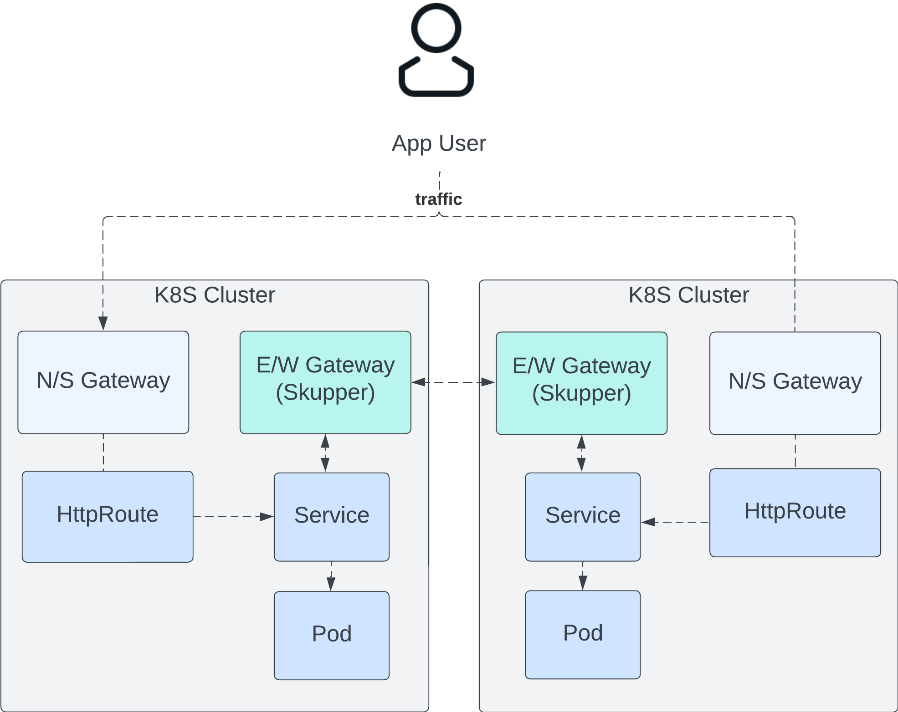

# Skupper proof of concept: 2 clusters & gateways, resiliency walkthrough

## Introduction

This walkthrough shows how Skupper can be used to provide service resiliency
across 2 clusters. Each cluster is running a Gateway with a HttpRoute in front
of an application Service. By leveraging Skupper, the application Service can be
exposed (using the skupper cli) from either cluster. If the Service is
unavailable on the local cluster, it will be routed to another cluster that has
exposed that Service. This can be very useful in a situation where directing
traffic to a specific Gateway via other means (like DNS) may take some time
to take effect.




## Requirements

* Local environment has been set up with a hub and spoke cluster, as per the [Multicluster Gateways Walkthrough](../how-to/multicluster-gateways-walkthrough.md).
  * The example multi-cluster Gateway has been deployed to both clusters
  * The example echo HttpRoute, Service and Deployment have been deployed to both clusters in the `default` namespace, and the `MGC_SUB_DOMAIN` env var set in your terminal
* [Skupper CLI](https://skupper.io/docs/cli/index.html#installing-cli) has been installed.

## Skupper Setup

Continuing on from the previous walkthrough, in first terminal, `T1`, install
Skupper on the hub & spoke clusters using the following command:

```bash
make skupper-setup
```

In `T1` expose the Service in the `default` namespace:

```bash
skupper expose deployment/echo --port 8080
```

Do the same in the workload cluster `T2`:

```bash
skupper expose deployment/echo --port 8080
```

Verify the application route can be hit,
taking note of the pod name in the response:

```bash
curl -k https://$MGC_SUB_DOMAIN
Request served by <POD_NAME>
```

Locate the pod that is currently serving requests. It is either in the hub or
spoke cluster. There goal is to scale down the deployment to 0 replicas.
Check in both `T1` and `T2`:

```bash
kubectl get po -n default | grep echo
```

Run this command to scale down the deployment in the right cluster:

```bash
kubectl scale deployment echo --replicas=0 -n default
```

Verify the application route can still be hit,
and the pod name matches the one that has *not* been scaled down.

```bash
curl -k https://$MGC_SUB_DOMAIN
```

You can also force resolve the DNS result to alternate between the 2 Gateway
clusters to verify requests get routed across the Skupper network.

```bash
curl -k --resolve $MGC_SUB_DOMAIN:443:172.31.200.2 https://$MGC_SUB_DOMAIN
curl -k --resolve $MGC_SUB_DOMAIN:443:172.31.201.2 https://$MGC_SUB_DOMAIN
```

## Known Issues

If you get an error response `no healthy upstream` from curl, there may be a
problem with the skupper network or link. Check back on the output from earlier
commands for any indication of problems setting up the network or link. The
skupper router & service controller logs can be checked in the `default`
namespace in both clusters.

You may see an error like below when running the `make skupper-setup` cmd.
```
Error: Failed to create token: Policy validation error: Timed out trying to communicate with the API: context deadline exceeded
```
This may be a timing issue or a platform specific problem. Either way, you can
try install a different version of the skupper CLI. This problem was seen on at
least 1 setup when using skupper v1.4.2, but didn't happen when dropped back to
1.3.0.
