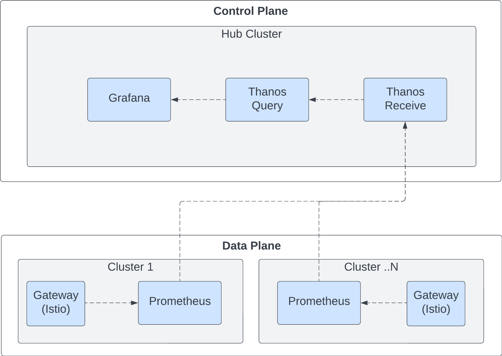
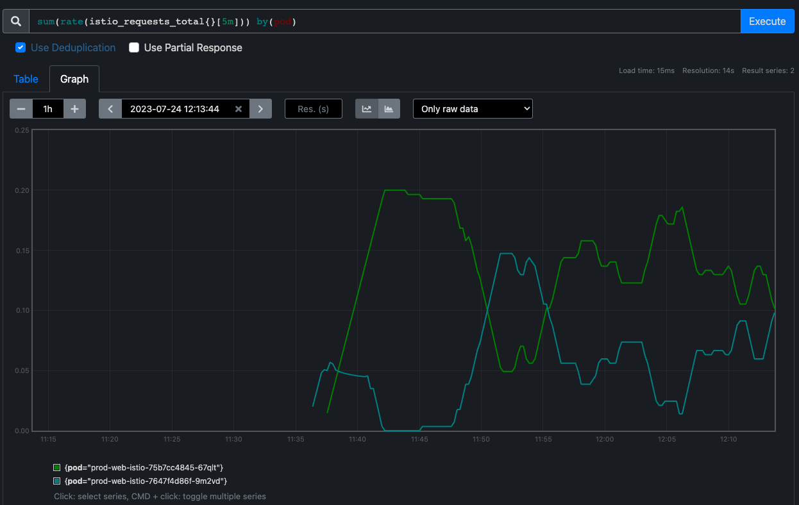
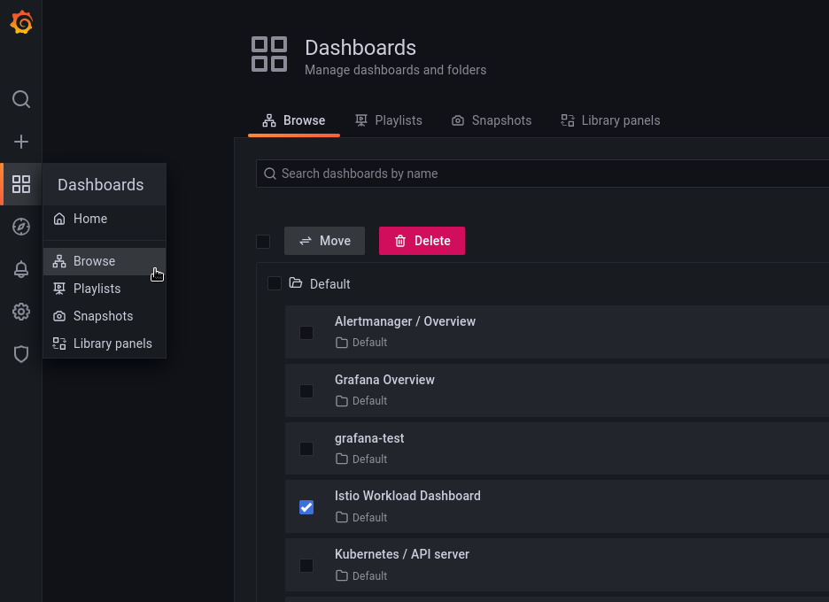

# Metrics Federation (WIP)

## Introduction

This walkthrough shows how to install a metrics federation stack locally and query Istio metrics from the hub.

>**Note:** :exclamation: this walkthrough is incomplete. It will be updated as issues from https://github.com/Kuadrant/multicluster-gateway-controller/issues/197 land



## Requirements

* Local development environment has been set up as per the main README i.e. local env files have been created with AWS credentials & a zone

>**Note:** :exclamation: this walkthrough will setup a zone in your AWS account and make changes to it for DNS purposes

## Installation and Setup

To setup a local instance with metrics federation, run:

```bash
make local-setup OCM_SINGLE=true METRICS_FEDERATION=true MGC_WORKLOAD_CLUSTERS_COUNT=1
```

Once complete, you should see something like the below in the output (you may need to scroll)

```
	Connect to Thanos Query UI

		URL : https://thanos-query.172.31.0.2.nip.io
```

Open the url in a browser, accepting the non CA signed certificate.
In the Thanos UI query box, enter the below query and press 'Execute'

```
sum(rate(container_cpu_usage_seconds_total{namespace="monitoring",container="prometheus"}[5m]))
```

You should see a response in the table view.
In the Graph view you should see some data over time as well.


## Istio Metrics

### Thanos Query UI

To query Istio workload metrics, you should first deploy a Gateway & HttpRoute, and send traffic to it.
The easiest way to do this is by following the steps in the [OCM Walkthrough](../how-to/multicluster-gateways-walkthrough.md). Before going through the walkthrough, there are two things to note: Firstly, you do not need to re-run the `make local-setup` step, as that should have already been run with the `METRICS_FEDERATION` flag above. Secondly, you should set `METRICS=true` when it comes to the step to start and deploy the gateway controller, i.e:

```
make build-controller kind-load-controller deploy-controller METRICS=true
```

After completing the OCM walkthrough, use `curl` to send some traffic to the application

```bash
while true; do curl -k https://$MGC_SUB_DOMAIN && sleep 5; done
```

Open the Thanos Query UI again and try the below query:

```
sum(rate(istio_requests_total{}[5m])) by(destination_workload)
```

In the graph view you should see something that looks like the graph below.
This shows the rate of requests (per second) for each Isito workload.
In this case, there is 1 workload, balanced across 2 clusters.


To see the rate of requests per cluster (actually per pod across all clusters), the below query can be used.
Over long periods of time, this graph can show traffic load balancing between application instances.

```
sum(rate(istio_requests_total{}[5m])) by(pod)
```



### Grafana UI

In the output from `local-setup`, you should see something like the below (you may need to scroll)

```
	Connect to Grafana Query UI

		URL : https://grafana.172.31.0.2.nip.io
```

Open Grafana in a browser, accepting the non CA signed certificate.
The default login is admin/admin.

Using the left sidebar in the Grafana UI, navigate to `Dashboards > Browse` and click on the `Istio Workload Dashboard`.



You should be able to see the following layout, which will include data from the `curl` command you ran in the previous section.

