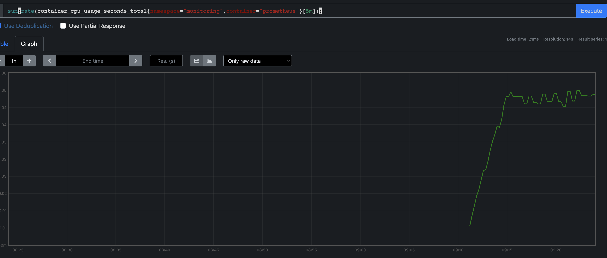

# Metrics Federation (WIP)

## Introduction

This walkthrough shows how to install a metrics federation stack locally and query metrics from the hub.

>**Note:** :exclamation: this walkthrough is incomplete. It will be updated as issues from https://github.com/Kuadrant/multicluster-gateway-controller/issues/197 land


## Requirements

* Local development environment has been set up as per the main README i.e. local env files have been created with AWS credentials & a zone

>**Note:** :exclamation: this walkthrough will setup a zone in your AWS account and make changes to it for DNS purposes

## Installation and Setup

To setup a local instance with metrics federation, run:

```bash
make local-setup OCM_SINGLE=true METRICS_FEDERATION=true MGC_WORKLOAD_CLUSTERS_COUNT=1
```

Once complete, you should see something like the below in the output (you may need to scroll)

```
	Connect to Thanos Query UI

		URL : https://thanos-query.172.32.0.2.nip.io
```

Open the url in a browser, accepting the non CA signed certificate.
In the Thanos UI query box, enter the below query and press 'Execute'

```
sum(rate(container_cpu_usage_seconds_total{namespace="monitoring",container="prometheus"}[5m]))
```

You should see a response in the table view.
In the Graph view you should see some data over time as well.


