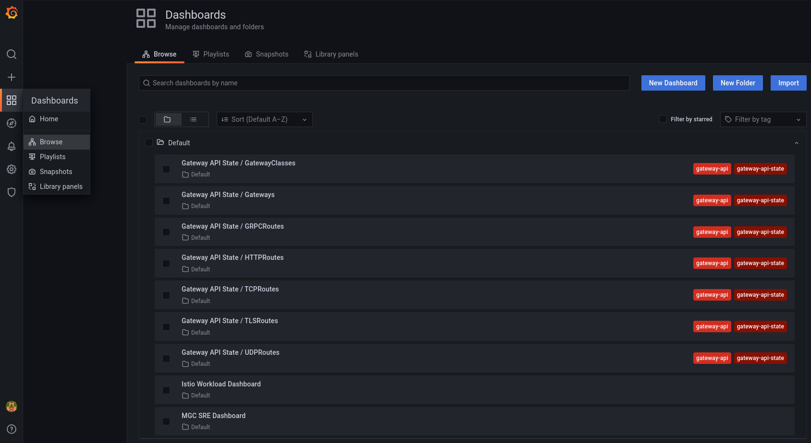
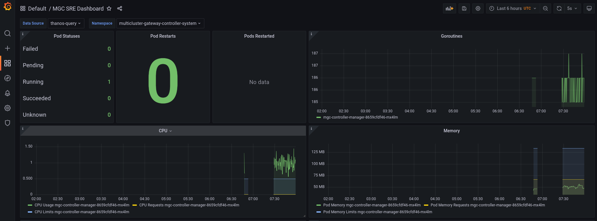
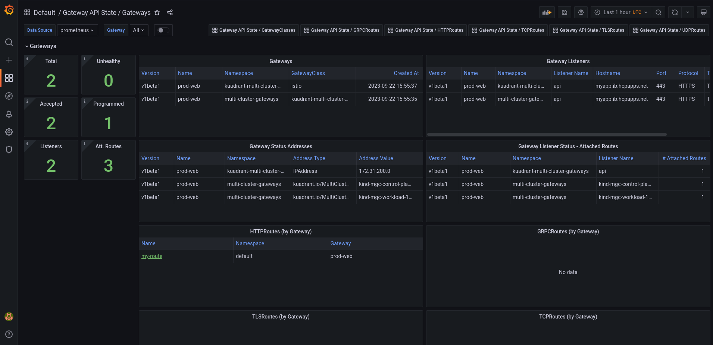
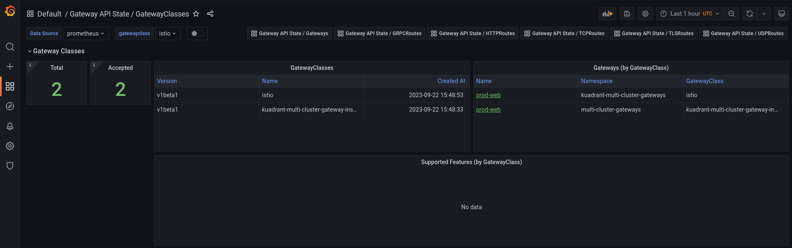
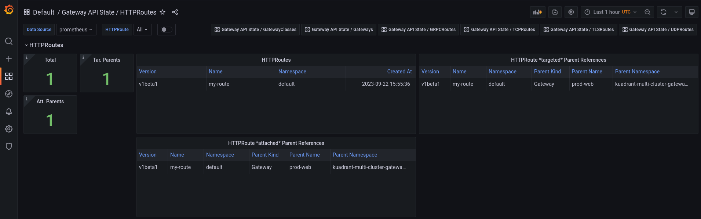

## Introduction

This walkthrough shows how to install a metrics federation stack locally and query Istio metrics from the hub.


## Installation and Configuration of Metrics
This document will guide you in installing metrics for your application and provide directions on where to access them. Additionally, it will include dashboards set up to display these metrics. 

## Requirements/prerequisites

Prior to commencing the metrics installation process, it is imperative that you have successfully completed the initial getting started guide. For reference, please consult the guide available at the following link: [Getting Started Guide.](../how-to/multicluster-gateways-walkthrough.md)

## Setting Up Metrics

To establish metrics, simply execute the following script in your terminal:

```bash
    curl https://raw.githubusercontent.com/kuadrant/multicluster-gateway-controller/main/hack/quickstart-metrics.sh | bash
```

This script will initiate the setup process for your metrics configuration.
After the script finishes running, you should see something like:

```
Connect to Thanos Query UI
    URL: https://thanos-query.172.31.0.2.nip.io

Connect to Grafana UI
    URL: https://grafana.172.31.0.2.nip.io
```

You can visit the Grafana dashboard by accessing the provided URL for Grafana UI. (you may need to scroll)

## Monitoring Operational Status in Grafana Dashboard

After setting up metrics, you can monitor the operational status of your system using the Grafana dashboard.

To generate traffic to the application, use `curl` as follows:

```bash
while true; do curl -k https://$MGC_SUB_DOMAIN && sleep 5; done
```

### Accessing the Thanos UI

1. Access the Thanos UI by clicking or entering the provided URL for the Grafana UI in your web browser.

```
https://thanos-query.172.31.0.2.nip.io
```

2. In the Thanos UI query box, enter the below query and press 'Execute'

```
sum(rate(container_cpu_usage_seconds_total{namespace="monitoring",container="prometheus"}[5m]))
```

You should see a response in the table view.
In the Graph view you should see some data over time as well.


```
sum(rate(istio_requests_total{}[5m])) by(destination_workload)
```

In the graph view you should see something that looks like the graph below.
This shows the rate of requests (per second) for each Isito workload.
In this case, there is 1 workload, balanced across 2 clusters.


To see the rate of requests per cluster (actually per pod across all clusters), the below query can be used.
Over long periods of time, this graph can show traffic load balancing between application instances.

```
sum(rate(istio_requests_total{}[5m])) by(pod)
```


### Accessing the Grafana Dashboard
To view the operational metrics and status, proceed with the following steps:

1. Access the Grafana dashboard by clicking or entering the provided URL for the Grafana UI in your web browser.

```
https://grafana.172.31.0.2.nip.io
```
>Note: The default login credentials for Grafana are admin/admin. You may need to accept the non-CA signed certificate to proceed.

2. Navigate to the included Grafana Dashboard

Using the left sidebar in the Grafana UI, navigate to `Dashboards > Browse` and select the `Istio Workload Dashboard`, `MGC SRE Dashboard` or any of the following `Gateway Api State` dashboards.



In `Istio Workload Dashboard` you should be able to see the following layout, which will include data from the `curl` command you ran in the previous section.


The `MGC SRE Dashboard` displays real-time insights and visualizations of resources managed by the multicluster-gateway-controller e.g. DNSPolicy, TLSPolicy, DNSRecord etc..



The `Gateway API State / Gateways` provides real-time insights and visualizations for Gateways. It offers information about gateway listeners, listener status, gateway status, addresses, and attached routes



The `Gateway API State / GatewayClasses` provides insights into Gateways organized by their respective Gateway Classes. It offers information about GatewayClasses and the supported features for each class.



The `Gateway API State / HTTPRoutes` or any of the remaining routes focuses on their `Routes` and provides insights into their configuration. It displays their targeted parent references, and attached parent references, offering a detailed view of how these routes are structured and associated with their respective resources.



The Grafana dashboard will provide you with real-time insights and visualizations of your gateway's performance and metrics.

By utilizing the Grafana dashboard, you can effectively monitor the health and behavior of your system, making informed decisions based on the displayed data. This monitoring capability enables you to proactively identify and address any potential issues to ensure the smooth operation of your environment.

