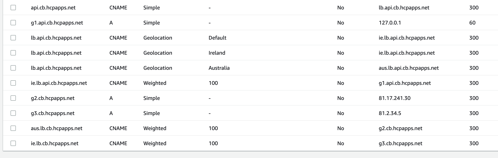
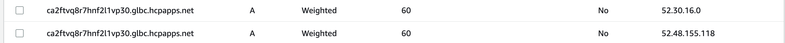

AWS supports Weighted(Weighted Round Robin) and Geolocation routing policies https://docs.aws.amazon.com/Route53/latest/DeveloperGuide/routing-policy.html. Both of these can be configured directly on records in AWS route 53.

**GEO Weighted**

**Weighted**

