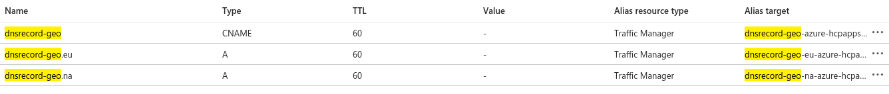
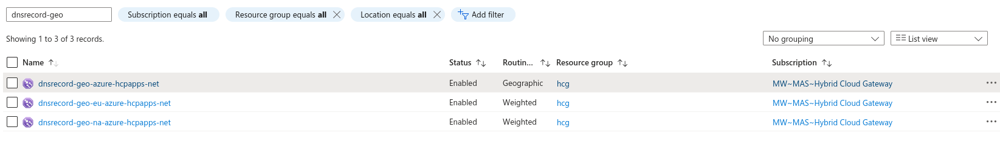

## Azure

https://portal.azure.com/

Azure supports Weighted and Geolocation routing policies, but requires records to alias to a Traffic Manager resource that must also be created in the users account https://learn.microsoft.com/en-us/azure/traffic-manager/traffic-manager-routing-methods

Notes:

* A Traffic Manager Profile is created per record set and is created with a routing method (Weighted or Geographic) https://portal.azure.com/#view/Microsoft_Azure_Network/LoadBalancingHubMenuBlade/~/TrafficManagers
* Only a singe IP can be added to a DNSRecord set. A traffic manager profile must be created and aliased from a DNSRecord set for anything that involves more than a single target.
* Significantly more resources to manage in order to achieve functionality comparable with Google and AWS. 
* The modelling of the records is significantly different from AWS Route53, but the current DNSRecord spec could still work. The azure implementation will have to process the endpoint list and create traffic manager policies as required to satisfy the record set.

Given the example DNSRecord [here](dnsrecord-geo.azure.hcpapps.net.yaml) describing a record set for a geo location routing policy with four clusters, two in two regions (North America and Europe), the following Azure resources are required.

Three DNSRecords, each aliased to a different traffic manager:



 * dnsrecord-geo-azure-hcpapps-net (dnsrecord-geo.azure.hcpapps.net) aliased to Traffic Manager Profile 1 (dnsrecord-geo-azure-hcpapps-net)
 * dnsrecord-geo-na.azure-hcpapps-net (dnsrecord-geo.na.azure.hcpapps.net) aliased to Traffic Manager Profile 2 (dnsrecord-geo-na-azure-hcpapps-net)
 * dnsrecord-geo-eu.azure-hcpapps-net (dnsrecord-geo.eu.azure.hcpapps.net) aliased to Traffic Manager Profile 3 (dnsrecord-geo-eu-azure-hcpapps-net)

Three Traffic Manager Profiles:



 * Traffic Manager Profile 1 (dnsrecord-geo-azure-hcpapps-net): Geolocation routing policy with two region specific FQDN targets (dnsrecord-geo.eu.azure.hcpapps.net and dnsrecord-geo.na.azure.hcpapps.net).
 * Traffic Manager Profile 2 (dnsrecord-geo-na-azure-hcpapps-net): Weighted routed policy with two IP address endpoints (172.32.0.1 and 172.32.0.2) with equal weighting.
 * Traffic Manager Profile 3 (dnsrecord-geo-eu-azure-hcpapps-net): Weighted routed policy with two IP address endpoints (172.32.0.3 and 172.32.0.4) with equal weighting. 

```bash
dig dnsrecord-geo.azure.hcpapps.net

; <<>> DiG 9.18.12 <<>> dnsrecord-geo.azure.hcpapps.net
;; global options: +cmd
;; Got answer:
;; ->>HEADER<<- opcode: QUERY, status: NOERROR, id: 16236
;; flags: qr rd ra; QUERY: 1, ANSWER: 3, AUTHORITY: 0, ADDITIONAL: 1

;; OPT PSEUDOSECTION:
; EDNS: version: 0, flags:; udp: 65494
;; QUESTION SECTION:
;dnsrecord-geo.azure.hcpapps.net. IN    A

;; ANSWER SECTION:
dnsrecord-geo.azure.hcpapps.net. 60 IN  CNAME   dnsrecord-geo-azure-hcpapps-net.trafficmanager.net.
dnsrecord-geo-azure-hcpapps-net.trafficmanager.net. 60 IN CNAME dnsrecord-geo.eu.azure.hcpapps.net.
dnsrecord-geo.eu.azure.hcpapps.net. 60 IN A     172.32.0.3

;; Query time: 88 msec
;; SERVER: 127.0.0.53#53(127.0.0.53) (UDP)
;; WHEN: Tue May 30 15:05:07 IST 2023
;; MSG SIZE  rcvd: 168
```