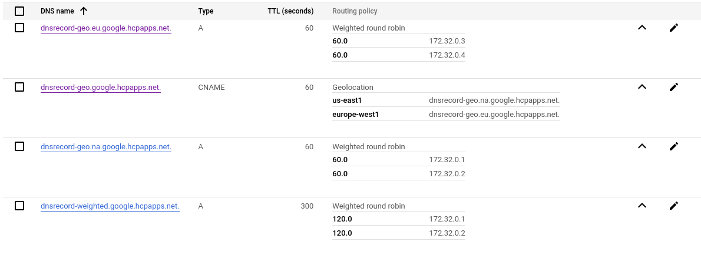

## Google

https://console.cloud.google.com/net-services/dns/zones

Google supports Weighted(Weighted Round Robin) and Geolocation routing policies https://cloud.google.com/dns/docs/zones/manage-routing-policies. Both of these can be configured directly on records in Google Cloud DNS and no secondary Traffic Management resource is required.

Notes:

* Record sets are modelled as a single endpoint with routing policy embedded. This is a different approach to Route53 where each individual A/CNAME would have its own record entry. 
* Weight must be an integer between 0 - 10000
* There are no continent options for region, only finer grained regions such as us-east1, europe-west-1 etc...
* There appears to be no way to set a default region, google just routes requests to the nearest supported region.
* The current approach used in AWS Route53 for geo routing will work in the same way on Google DNS. A single CNAME record with geo routing policy specifying multiple geo specific A record entries as targets.
* Geo and weighted routing can be combined, as with AWS Route53, allowing traffic with a region to be routed using weightings.
* The modelling of the records is slightly different from AWS, but the current DNSRecord spec could still work. The Google implementation of AddRecords will have to process the list of endpoints in order to group related endpoints in order to build up the required API request.
In this case there would not be a 1:1 mapping between an endpoint in a DNSRecord and the dns provider, but the DNSRecord contents would be kept consistent across all providers and compatibility with external-dns would be maintained.


Example request for Geo CNAME record:

POST https://dns.googleapis.com/dns/v1beta2/projects/it-cloud-gcp-rd-midd-san/managedZones/google-hcpapps-net/rrsets
```json
{
  "name": "dnsrecord-geo.google.hcpapps.net.",
  "routingPolicy": {
    "geo": {
      "item": [
        {
          "location": "us-east1",
          "rrdata": [
            "dnsrecord-geo.na.google.hcpapps.net."
          ]
        },
        {
          "location": "europe-west1",
          "rrdata": [
            "dnsrecord-geo.eu.google.hcpapps.net."
          ]
        }
      ],
      "enableFencing": false
    }
  },
  "ttl": 60,
  "type": "CNAME"
}
```

Example request for Weighted A record:

POST https://dns.googleapis.com/dns/v1beta2/projects/it-cloud-gcp-rd-midd-san/managedZones/google-hcpapps-net/rrsets
```json
{
  "name": "dnsrecord-geo.na.google.hcpapps.net.",
  "routingPolicy": {
    "wrr": {
      "item": [
        {
          "weight": 60.0,
          "rrdata": [
            "172.31.0.1"
          ]
        },
        {
          "weight": 60.0,
          "rrdata": [
            "172.31.0.2"
          ]
        }
      ]
    }
  },
  "ttl": 60,
  "type": "A"
}
```

Given the example DNSRecord [here](dnsrecord-geo.google.hcpapps.net.yaml) describing a record set for a geo location routing policy with four clusters, two in two regions (North America and Europe), the following resources are required.

Three DNSRecords, one CNAME (dnsrecord-geo.google.hcpapps.net) and 2 A records (dnsrecord-geo.na.google.hcpapps.net and dnsrecord-geo.eu.google.hcpapps.net)



```bash
dig dnsrecord-geo.google.hcpapps.net

; <<>> DiG 9.18.12 <<>> dnsrecord-geo.google.hcpapps.net
;; global options: +cmd
;; Got answer:
;; ->>HEADER<<- opcode: QUERY, status: NOERROR, id: 22504
;; flags: qr rd ra; QUERY: 1, ANSWER: 2, AUTHORITY: 0, ADDITIONAL: 1

;; OPT PSEUDOSECTION:
; EDNS: version: 0, flags:; udp: 65494
;; QUESTION SECTION:
;dnsrecord-geo.google.hcpapps.net. IN   A

;; ANSWER SECTION:
dnsrecord-geo.google.hcpapps.net. 60 IN CNAME   dnsrecord-geo.eu.google.hcpapps.net.
dnsrecord-geo.eu.google.hcpapps.net. 60 IN A    172.31.0.4

;; Query time: 33 msec
;; SERVER: 127.0.0.53#53(127.0.0.53) (UDP)
;; WHEN: Tue May 30 15:05:25 IST 2023
;; MSG SIZE  rcvd: 108

```